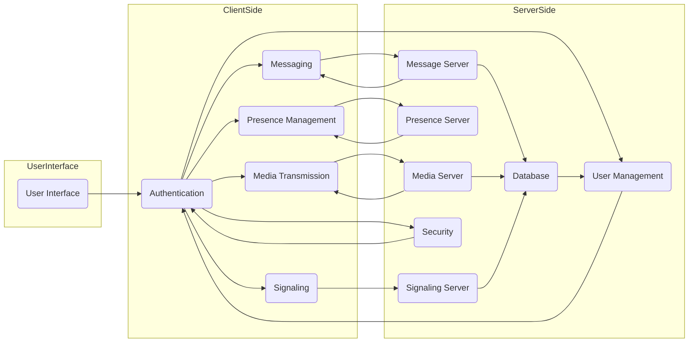
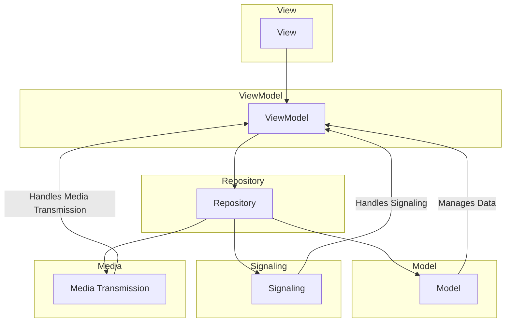
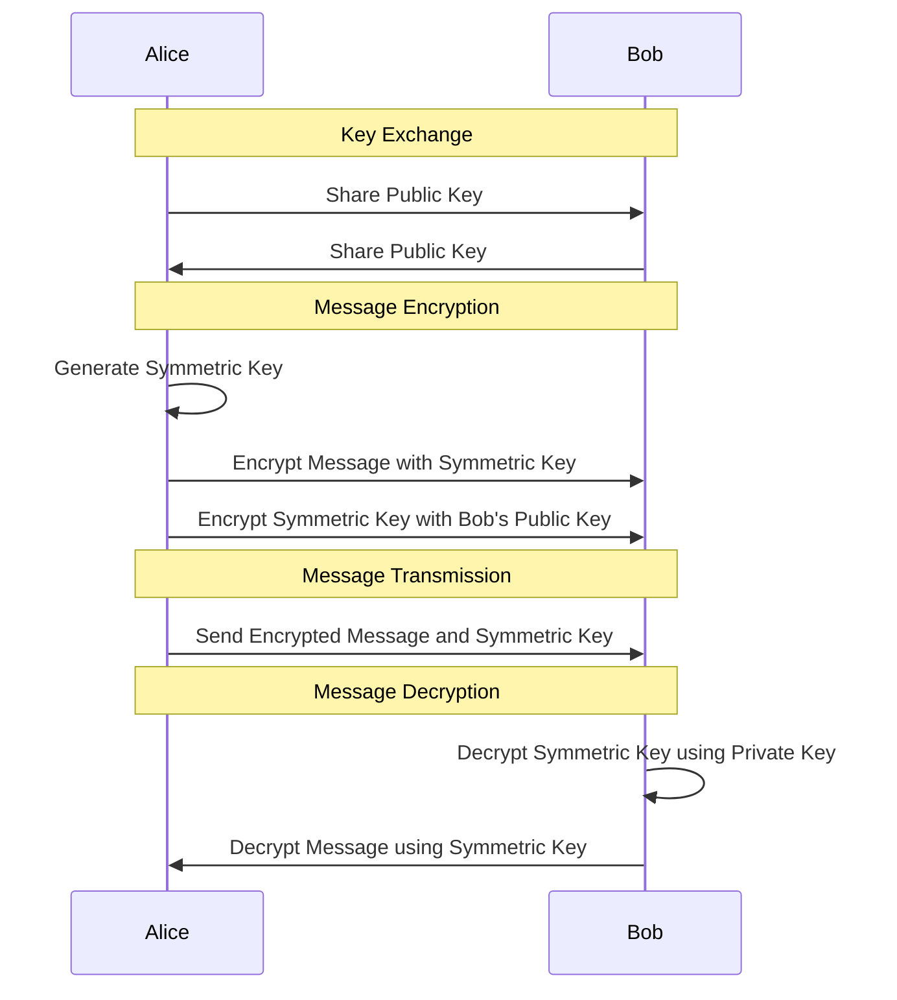

### VoIP App diagram

```mermaid
flowchart LR

subgraph UserInterface
  UI(User Interface)
end

subgraph ClientSide
  UI --> Auth(Authentication)
  Auth --> Signal(Signaling)
  Auth --> Media(Media Transmission)
  Auth --> Presence(Presence Management)
  Auth --> Messaging(Messaging)
end

subgraph ServerSide
  DB(Database)
  Signal --> SignalServer(Signaling Server)
  Media --> MediaServer(Media Server)
  Presence --> PresenceServer(Presence Server)
  Messaging --> MessageServer(Message Server)
  Auth --> UserManagement(User Management)
  Auth --> Security(Security)
  Security --> Auth
  MediaServer --> Media
  PresenceServer --> Presence
  MessageServer --> Messaging
end

DB --> UserManagement
UserManagement --> Auth
MessageServer --> DB
MediaServer --> DB
SignalServer --> DB


```
#### Client implementation using MVVM

```mermaid
graph TD

subgraph ViewModel
  VM[ViewModel]
end

subgraph View
  V[View]
end

subgraph Model
  M[Model]
end

subgraph Signaling
  S[Signaling]
end

subgraph Media
  MT[Media Transmission]
end

subgraph Repository
  R[Repository]
end

VM --> R
V --> VM
R --> S
R --> MT
R --> M
S -->|Handles Signaling| VM
MT -->|Handles Media Transmission| VM
M -->|Manages Data| VM

```

### Message E2E Encryption flow

```mermaid
sequenceDiagram
    participant Alice
    participant Bob

    note over Alice, Bob: Key Exchange

    Alice ->> Bob: Share Public Key
    Bob ->> Alice: Share Public Key

    note over Alice, Bob: Message Encryption

    Alice ->> Alice: Generate Symmetric Key
    Alice ->> Bob: Encrypt Message with Symmetric Key
    Alice ->> Bob: Encrypt Symmetric Key with Bob's Public Key

    note over Alice, Bob: Message Transmission

    Alice ->> Bob: Send Encrypted Message and Symmetric Key

    note over Bob, Alice: Message Decryption

    Bob ->> Bob: Decrypt Symmetric Key using Private Key
    Bob ->> Alice: Decrypt Message using Symmetric Key
```
